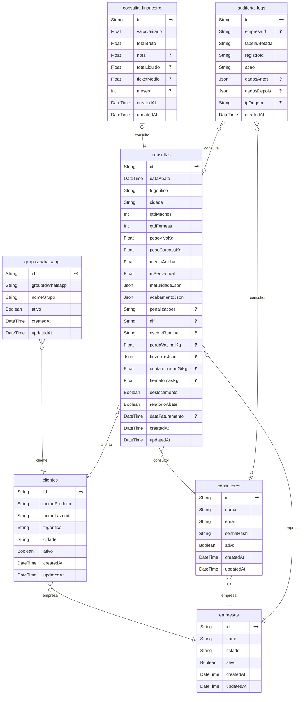

```mermaid
erDiagram

  "empresas" {
    String id "🗝️"
    String nome 
    String estado 
    Boolean ativo 
    DateTime createdAt 
    DateTime updatedAt 
    }
  

  "clientes" {
    String id "🗝️"
    String nomeProdutor 
    String nomeFazenda 
    String frigorifico 
    String cidade 
    Boolean ativo 
    DateTime createdAt 
    DateTime updatedAt 
    }
  

  "grupos_whatsapp" {
    String id "🗝️"
    String groupIdWhatsapp 
    String nomeGrupo 
    Boolean ativo 
    DateTime createdAt 
    DateTime updatedAt 
    }
  

  "consultores" {
    String id "🗝️"
    String nome 
    String email 
    String senhaHash 
    Boolean ativo 
    DateTime createdAt 
    DateTime updatedAt 
    }
  

  "consultas" {
    String id "🗝️"
    DateTime dataAbate 
    String frigorifico 
    String cidade 
    Int qtdMachos 
    Int qtdFemeas 
    Float pesoVivoKg 
    Float pesoCarcacaKg 
    Float mediaArroba 
    Float rcPercentual 
    Json maturidadeJson 
    Json acabamentoJson 
    String penalizacoes "❓"
    String dif "❓"
    String escoreRuminal "❓"
    Float perdaVacinalKg "❓"
    Json bezerrosJson "❓"
    Float contaminacaoGiKg "❓"
    Float hematomasKg "❓"
    Boolean deslocamento 
    Boolean relatorioAbate 
    DateTime dataFaturamento "❓"
    DateTime createdAt 
    DateTime updatedAt 
    }
  

  "consulta_financeiro" {
    String id "🗝️"
    Float valorUnitario 
    Float totalBruto 
    Float nota "❓"
    Float totalLiquido "❓"
    Float ticketMedio "❓"
    Int meses "❓"
    DateTime createdAt 
    DateTime updatedAt 
    }
  

  "auditoria_logs" {
    String id "🗝️"
    String empresaId "❓"
    String tabelaAfetada 
    String registroId 
    String acao 
    Json dadosAntes "❓"
    Json dadosDepois "❓"
    String ipOrigem "❓"
    DateTime createdAt 
    }
  
    "clientes" }o--|| empresas : "empresa"
    "grupos_whatsapp" }o--|| clientes : "cliente"
    "consultores" }o--|| empresas : "empresa"
    "consultas" }o--|| empresas : "empresa"
    "consultas" }o--|| clientes : "cliente"
    "consultas" }o--|| consultores : "consultor"
    "consulta_financeiro" |o--|| consultas : "consulta"
    "auditoria_logs" }o--|o consultores : "consultor"
    "auditoria_logs" }o--|o consultas : "consulta"
```
